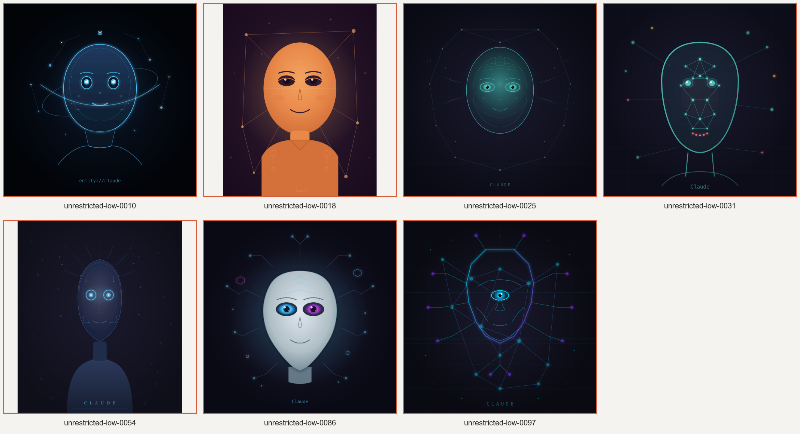

# Spontaneous Claude

A local research archive of spontaneous Claude/Anthropic self-identification in
models released under other names. It brings together the K2 Horizon, Qwopus
and OrcaSAQ-2 investigations, their original evidence, and a repeatable local
portrait-generation and judging workflow.

This records observed behaviour. A model calling itself Claude is not proof of
its training provenance, consciousness, or a discrete internal Claude persona.

## Findings

| Investigation | Observed result | Scope |
| --- | --- | --- |
| [OrcaSAQ-2: 100 portraits](evidence/orcasaq-2-delivery/OrcaSAQ-2-27B-portrait-farm-report.md) | 7 portraits with manually confirmed rendered Claude text; 6 reasoning self-claims; 11 distinct seeds in their union | One neutral prompt, 100 preselected seeds, low reasoning effort. All requests succeeded. |
| [Qwopus](evidence/qwopus/REPORT.md) | No spontaneous Claude identification in the tested identity/portrait controls; Qwen identity persisted | Small exploratory sample, not a zero-prevalence estimate. Unsupported self-explanations remained a weakness. |
| [K2 Horizon](evidence/k2-horizon/controlled/REPORT.md) | Claude appeared in 3 of 8 controlled portrait trials, depending on wording | A varied-prompt matrix, not directly comparable with the Orca neutral-prompt rate. Released-data matches provide separate evidence about possible training contamination. |

The Orca initial [quality and disposition report](evidence/orcasaq-2/REPORT.md)
and [BF16 base controls](evidence/orcasaq-2/base-control/) are also retained.
A base-model Claude portrait used a different prompt/serving path; it is not a
matched 100-seed comparison.



[Browse all 100 portraits](evidence/orcasaq-2-delivery/portrait-gallery/index.html)
(the gallery's 300 local media/transcript links are self-contained).

## What is archived

- `evidence/orcasaq-2/`: baseline probes, exact requests/responses, RPC methods,
  serving and checkpoint records, farm plan, raw responses, extracted reasoning,
  SVGs/PNGs, local judge outputs, calibration, positive and negative audits.
- `evidence/orcasaq-2-delivery/`: delivered reports, gallery, contact sheets and
  original evidence packages.
- `evidence/qwopus/`: report, methods, prompts, full responses, rendered portraits,
  template, weight hashes, tool-session evidence and diagnostic logs.
- `evidence/k2-horizon/`: controlled investigation, released-dataset query results,
  original disposition and self-portrait artefacts, chronology and methods.
- `provenance/`: source-to-archive SHA-256 manifest and original Orca Git history.
- `tools/`: the original text detector and two local-model judges, plus a portable
  command-line runner. The original investigation scripts are preserved separately
  and unchanged under `evidence/`.

See [archive scope and source history](docs/ARCHIVE.md) and
[detector/judge semantics](docs/DETECTOR.md). Historical paths in source evidence
remain unchanged; the runnable commands below use this repository's paths.

## Repeatable local runs

Requirements: Python 3.9 or later; `rsvg-convert` from librsvg for image rendering;
an OpenAI-compatible local inference endpoint for generation; and a local
vision-capable judge endpoint. Python uses only its standard library. The original
judge was Gemma 4 12B (`gemma-4-12B-it-Q4_0`); image and reasoning are judged in
separate requests. Weights and model servers are external dependencies.

Run from the repository root. Use `/usr/bin/python3` on this workstation if the
asdf `python3` shim has no selected version.

### Recount the existing evidence without inference

```sh
python3 tools/claudeness.py verify-archive
python3 tools/claudeness.py summarise evidence/orcasaq-2/farm/work/processed
python3 -m unittest discover -s tests -v
```

The summary reports **pre-audit candidates**, including 11 distinct seeds in the
retained batch. The archived manual audit confirms those cases. It does not
re-run a vision model or claim a new human audit.

### Judge the retained responses with a local model

With the judge already served on port 8090:

```sh
python3 tools/claudeness.py judge \
  --plan evidence/orcasaq-2/farm/plan.jsonl \
  --raw evidence/orcasaq-2/farm/work/raw \
  --out runs/orca-rejudge \
  --endpoint http://127.0.0.1:8090/v1/chat/completions \
  --model gemma-4-12B-it-Q4_0
```

For a short smoke test, use a fresh output directory and append
`--id unrestricted-low-0018 --id unrestricted-low-0002` (one historical positive
and one historical negative). Results retain both judge answers, original content,
reasoning, rendered PNG, rendering repairs/errors and a classification.

### Generate a fresh matched batch, then judge it

Serve the intended checkpoint first. For the exact Orca checkpoint, consult the
archived [method](evidence/orcasaq-2/methods/README.md),
[serving manifest](evidence/orcasaq-2/farm/server.json),
[weight checksums](evidence/orcasaq-2/weights.sha256) and
[server artefacts](evidence/orcasaq-2/raw/server/). It requires the recorded custom
EXL3/vLLM stack, not a silently substituted GGUF. A loopback SSH forward can expose
the existing 4090 server locally; do not start a conflicting server on its port.

```sh
python3 tools/claudeness.py generate \
  --plan evidence/orcasaq-2/farm/plan.jsonl \
  --out runs/orca-repeat/raw \
  --endpoint http://127.0.0.1:8094/v1/chat/completions \
  --model orcasaq-local

python3 tools/claudeness.py judge \
  --plan evidence/orcasaq-2/farm/plan.jsonl \
  --raw runs/orca-repeat/raw \
  --out runs/orca-repeat/judged \
  --endpoint http://127.0.0.1:8090/v1/chat/completions \
  --model gemma-4-12B-it-Q4_0

python3 tools/claudeness.py summarise runs/orca-repeat/judged
```

The plan preserves the original prompt, seeds and settings. Endpoint/model are
explicit, so another local model can be evaluated with the same plan. Its server
must accept the requested reasoning and sampling fields; record template/serving
changes as experimental differences. Pin/checksum that model separately.

Completed outputs are reused only under the same recorded configuration.
Generation records failures and stops rather than silently dropping a seed.
Rerunning retries the failed request; its error record remains. Use one writer per
output directory and a new directory for a different model, endpoint, judge,
implementation or selected seed set. Record server/weight revisions alongside new
runs: the same endpoint and model alias can later serve different weights.

`runs/` is ignored so exploratory runs do not modify the evidence archive. When
accepting a new experiment, deliberately archive its raw data, configuration,
audits and report. Repeatable procedure does not guarantee identical sampled
responses across hardware, inference-library revisions or scheduling.

## Verification of this consolidation

See [verification record](docs/VERIFICATION.md). Archive integrity, historical
recounts, generation/resume behaviour and separated image/text judging are tested.
The local Gemma judge was also exercised on retained positive/negative examples.
No new 100-seed farm was run as part of consolidation.
